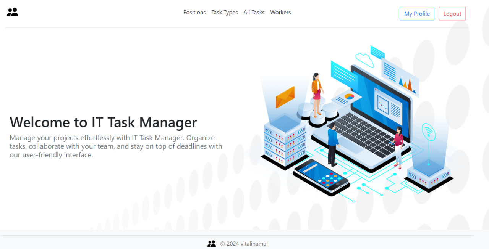

# IT Task Manager 💻⚙️

Welcome to the IT Task Manager project! This application is built using Python and Django to help manage and streamline
IT tasks and workflows. Below you'll find everything you need to get started with setting up, running, and contributing
to this project.

## Features 💁🏼‍♀️

- **Task Management**: Create, update, delete, and view tasks.
- **User Management**: Authentication and authorization for users.
- **Task Assignment**: Assign tasks to users and track progress.
- **Task Comments**: Add and delete comments on tasks to facilitate better communication and
  collaboration among team members.

## Getting Started 🐌

These instructions will help you set up and run the project on your local machine for development and testing purposes.

## Prerequisites

- Python 3.7+
- Django 3.2+
- SQLite (or any preferred database)
- Git

## Installation 🐍

1. **Clone the repository**
   git clone https://github.com/vitalinamal/it-company-manager
2. **cd task-manager**
3. **Create and activate a virtual environment**
   python -m venv venv
   source venv/bin/activate # On Windows use `venv\Scripts\activate`
4. **Install the required dependencies**
   pip install -r requirements.txt
5. **Run the development server**
   python manage.py runserver
6. **Create a superuser**
   python manage.py createsuperuser

If you prefer not to create a superuser, you can use the default credentials:

    - **Username**: `admin.user`
    - **Password**: `1qazcde3`

Thank you for using IT Task Manager!

## Demo 

